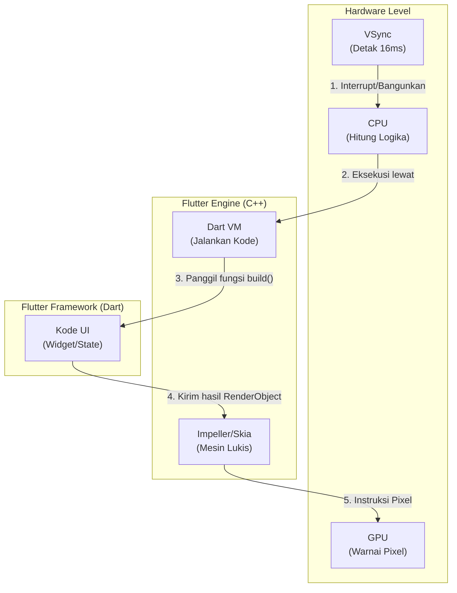

# Anatomi & Arsitektur Jeroan UI Flutter

Dokumen ini membedah teknologi di balik Flutter, dari level perangkat keras (GPU) hingga ke level bahasa pemrograman (Dart). Memahami "jeroan" ini adalah kunci untuk menjadi **Expert Flutter Developer** yang mampu membuat UI super responsif tanpa lag (60/120 FPS).

---

## 1. Level Hardware & OS (Kuli Keras)

Di ujung paling bawah, Flutter berkomunikasi langsung dengan perangkat keras HP tanpa menggunakan komponen UI bawaan OS (OEM Widgets seperti `View` di Android atau `UIView` di iOS).

*   **VSync (Vertical Sync):** Ini adalah "Detak Jantung" layar HP. Layar memancarkan sinyal VSync setiap 16 milidetik (untuk layar 60Hz) atau 8 milidetik (untuk 120Hz). Flutter "mendengarkan" detak jantung ini. Jika dalam 16ms Flutter gagal merakit UI, maka terjadilah **Jank (Lag / Frame Drop)**.
    > 🔗 **Deep Dive Khusus:** Penasaran teknologi hardware apa yang menciptakan sinyal 16ms ini? Baca selengkapnya di [Deep Dive: VSync & Teknologi Hardware](vsync_and_display_hardware.md).
*   **GPU (Graphics Processing Unit):** Otot utama yang bertugas mewarnai jutaan pixel di layar. Flutter melemparkan instruksi gambar matematika langsung ke GPU.
*   **CPU (Central Processing Unit):** Otak yang mengeksekusi logika Dart (menghitung state, *if-else*, dan posisi UI).

---

## 2. Flutter Engine (C++) - Mesin Pabrik

Ini adalah mesin rahasia Flutter yang ditulis menggunakan bahasa C++ agar berjalan secepat kilat.

*   **Skia / Impeller (Graphics Engine):** Ini adalah pelukisnya. Ketika kita membuat kotak merah bulat, Dart tidak menggambar kotak. Dart mengirim perintah ke Skia/Impeller: *"Tolong gambar persegi dengan sudut 10px dan warna hex #FF0000"*. Skia/Impeller menerjemahkan instruksi ini menjadi perintah *OpenGL/Vulkan/Metal* yang dipahami GPU. (Impeller adalah mesin generasi baru buatan Google khusus untuk Flutter).
*   **Dart VM (Virtual Machine):** Mesin yang menjalankan kode Dart. Di mode *Debug*, dia menggunakan JIT (*Just-In-Time*) agar *Hot Reload* bisa berjalan. Di mode *Release*, kode dikompilasi menjadi AOT (*Ahead-Of-Time* / *Machine Code* murni) sehingga sangat cepat.
*   **Text Shaping (HarfBuzz) & Layout:** Engine yang bertugas menghitung jarak antar huruf (*kerning*), huruf Arab (RTL), dan emoji.

### Flowchart Interaksi Hardware & Mesin Flutter

**Penjelasan Alur Interaksi (Siklus 16 Milidetik):**
1. **VSync Interrupt CPU:** Layar (Hardware) mengirimkan sengatan listrik (*Interrupt*) ke CPU untuk meminta gambar baru.
2. **CPU Mengeksekusi DartVM:** CPU segera melakukan *Context Switch* dan menjalankan mesin *DartVM* tempat aplikasi kita berada.
3. **Panggil Fungsi `build()`:** *DartVM* mengeksekusi kodingan UI (Widget/State) milik kita untuk menghitung ulang tata letak dan posisi tombol.
4. **Kirim RenderObject:** Setelah perhitungan selesai, UI kita mengembalikan instruksi *RenderObject* kepada mesin *Impeller* (C++).
5. **Instruksi Pixel:** *Impeller* menerjemahkan instruksi tersebut menjadi koordinat *pixel* biner (0101) murni dan menembakkannya ke GPU untuk diwarnai di layar kaca.

---

## 3. Flutter Framework (Dart) - Arsitek UI

Di sinilah kita (developer) bekerja. Flutter UI digerakkan oleh arsitektur yang sangat terkenal: **The Three Trees (Tiga Pohon Nyawa)**.

### A. Struktur Data Inti: *N-Ary Tree*
UI Flutter disimpan di RAM dalam bentuk struktur data **N-Ary Tree** (Pohon bercabang banyak). Pemilihan struktur data ini sangat jenius karena hierarki visual manusia memang berbentuk cabang (Satu layar punya banyak baris, satu baris punya banyak teks).

### B. Algoritma Inti: *Linear Reconciliation (O(N))*
Membandingkan dua pohon UI yang kompleks seharusnya memakan waktu eksponensial **O(N³)**. Tapi Flutter (terinspirasi dari React) menggunakan algoritma heuristik yang memangkas waktu komputasi menjadi **O(N)** (Linear). Rahasianya: Flutter hanya membandingkan *Widget* yang berada di tingkat (level) kedalaman yang sama.

### C. 3 Pohon Kehidupan (The Three Trees)

1.  **Widget Tree (Kertas Blueprint / Konfigurasi)**
    *   **Sifat:** *Immutable* (Tidak bisa diubah), sangat ringan, dan *Disposable* (Gampang dibuang).
    *   **Fungsi:** Kumpulan pengaturan statis. Saat kita mengetik `Text('Halo')`, kita BUKAN membuat teks di layar. Kita cuma menulis instruksi konfigurasi di atas kertas: *"Saya mau teks Halo"*.
2.  **Element Tree (Mandor Bangunan)**
    *   **Sifat:** *Mutable* (Bisa berubah), hidup lama di memori, dan mengelola *State*. (Objek `BuildContext` yang sering kita pakai sebenarnya adalah sebuah `Element`).
    *   **Fungsi:** Mandor yang menjembatani *Blueprint* (Widget) dan *Kuli* (RenderObject). Saat layar di- *rebuild*, Mandor ini TIDAK hancur. Dia hanya mengambil *Blueprint* (Widget) baru, membandingkannya dengan yang lama, dan memerintahkan *Kuli* untuk mengubah sedikit warna/teks jika ada perbedaan (Inilah rahasia performa tinggi Flutter).
3.  **RenderObject Tree (Kuli Bangunan)**
    *   **Sifat:** *Mutable*, sangat berat, mahal untuk dibuat.
    *   **Fungsi:** Obyek matematika yang memiliki atribut X, Y, Width, dan Height nyata. Dia yang bertugas menghitung *Layout* dan memerintahkan Skia/Impeller untuk *Painting* (Melukis pixel).

---

## 4. Algoritma "One-Pass Layout" (Aturan Emas Fisika UI)

Engine UI lain (seperti HTML/CSS atau Android XML) sering mengalami *lag* karena mereka menghitung ukuran UI secara berulang-ulang (*Multi-pass layout*). 
Flutter menyelesaikan masalah ukuran dalam SATU KALI jalan (*One-Pass Layout*) menggunakan algoritma rekursif *Top-Down & Bottom-Up*:

> **"Constraints go down. Sizes go up. Parent sets position."**

1.  **Constraints Go Down (Batasan Turun):** *Parent* (Atasan) berteriak ke *Child* (Anak): *"Hei anak, kamu boleh punya lebar antara 0 sampai 100px!"*
2.  **Sizes Go Up (Ukuran Naik):** Anak menghitung kebutuhannya, lalu lapor balik ke Atasan: *"Oke bos, karena tulisanku pendek, aku ambil lebar 50px ya!"*
3.  **Parent Sets Position (Atasan Nentuin Posisi):** Atasan menjawab: *"Sip, ukurannmu 50px, sekarang kamu duduk di koordinat X:20, Y:30!"*

Kombinasi Algoritma *One-Pass Layout*, struktur data *N-Ary Tree*, dan jembatan *C++ Impeller* inilah yang membuat Flutter mampu merender UI animasi gila-gilaan stabil di **120 Frame Per Second**.
