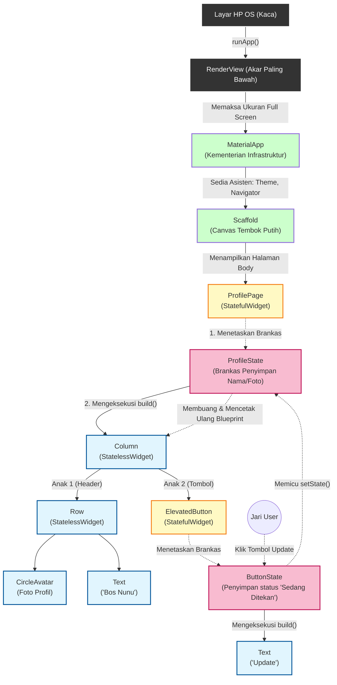

# Masterclass: Anatomi Total Widget Tree dari Nol sampai Halaman Profil

Dokumen ini adalah "The Grand Unified Theory" (Teori Kesatuan Besar) dari cara kerja *Widget Tree* di Flutter. Alih-alih melompat dari satu file ke file lain, dokumen ini merunut perjalanan arsitektur secara linear: dari akar perangkat keras OS, menuju `runApp`, hingga merender sebuah halaman `ProfilePage` yang *Stateful* dan kompleks.

---

## 1. Peta Jalan Arsitektur (The Grand Diagram)

Berikut adalah Rontgen Arsitektur dari sebuah aplikasi nyata, dari atas sampai ke bawah.
Perhatikan warna dan bentuknya:
*   ⬛ **Hitam:** Level Sistem Operasi & Akar Layar.
*   🟩 **Hijau:** Fondasi Infrastruktur (`MaterialApp` / `Scaffold`).
*   🟨 **Kuning:** `StatefulWidget` (Widget yang punya Brankas).
*   💖 **Merah Muda:** `State` Object (Brankas Memori tempat menyimpan data).
*   🟦 **Biru:** `StatelessWidget` (Batu bata murni yang bodoh).

---

## 2. Rangkuman Perjalanan Epik (Step-by-Step)

Mari kita baca diagram di atas bagaikan sebuah cerita:

### Fase 1: Penciptaan Alam Semesta (`runApp`)
Ketika aplikasi baru dibuka, **Layar OS** memerintahkan Flutter untuk membuat **`RenderView`**. `RenderView` ini mengunci ukuran layar secara mutlak (misal: 1080x2400) dan menuntut anak di bawahnya untuk melar sepenuh layar.

### Fase 2: Pembangunan Infrastruktur Kota (`MaterialApp` & `Scaffold`)
`MaterialApp` rela ditarik melar sepenuh layar. Ia menguasai ukuran 1080x2400 tersebut, lalu diam-diam membangun aturan hukum: warna tema, batas poni kamera, dan rute halaman. Setelah hukum selesai, ia membentangkan **`Scaffold`** (Sebuah tembok kanvas putih bersih). Di titik ini, aplikasi siap untuk dicoret-coret.

### Fase 3: Kedatangan Sang Tuan Tanah (`ProfilePage` - StatefulWidget)
Kita menempelkan `ProfilePage` di atas kanvas `Scaffold`. 
Karena `ProfilePage` adalah `StatefulWidget`, pada detik pertama dia lahir, dia langsung menetaskan **`State` (Brankas Merah Muda)**. `ProfilePage` hanyalah Kertas Biru sementara, sedangkan Brankas Merah Muda inilah nyawa abadi dari halaman tersebut.

### Fase 4: Pembangunan Batu Bata (`Column`, `Row`, `Text`)
Brankas `State` menjalankan fungsi `build()`, yang menyusun batu bata ke bawah. 
*   Dia menaruh `Column` (Susunan Vertikal).
*   Di dalam `Column`, dia menaruh `Row` (Susunan Horizontal).
*   Di dalam `Row`, ada Foto dan Teks.
Ini semua adalah `StatelessWidget`. Mereka tidak punya nyawa dan tidak punya Brankas. Mereka cuma Kertas Biru bodoh yang pasrah mau digambar seperti apa.

### Fase 5: Misteri Tombol (`ElevatedButton`)
Kenapa `ElevatedButton` warnanya Kuning (`StatefulWidget`) di diagram?
Karena tombol bawaan Flutter itu aslinya cerdas. Saat jari Bos memencet tombol itu, harus ada animasi air berdesir (*Ripple Effect*). Untuk menyimpan memori *"Oh aku sedang ditekan, keluarkan animasi air"*, tombol itu wajib punya Brankas Memori (`State`) miliknya sendiri secara rahasia!

### Fase 6: Kiamat Kecil (Eksekusi `setState()`)
Saat Bos mengeklik tombol *Update*, Bos memanggil `setState()` di dalam Brankas Halaman (`ProfileState`).
1. Brankas langsung menandai dirinya "Kotor".
2. Saat VSync tiba (16ms kemudian), Brankas **MENGHANCURKAN** kertas `Column`, `Row`, dan `Text` ke tong sampah.
3. Brankas mencetak Kertas Biru yang baru (misal Teksnya berubah jadi "Bos Nunu Updated").
4. Kertas baru diserahkan ke Mandor (*Element*), dan layar berubah seketika.

Itulah cara kerja alam semesta Flutter secara utuh dalam satu halaman penuh. Tidak ada sihir, hanya tumpukan hierarki yang dikelola dengan sangat rapi!
