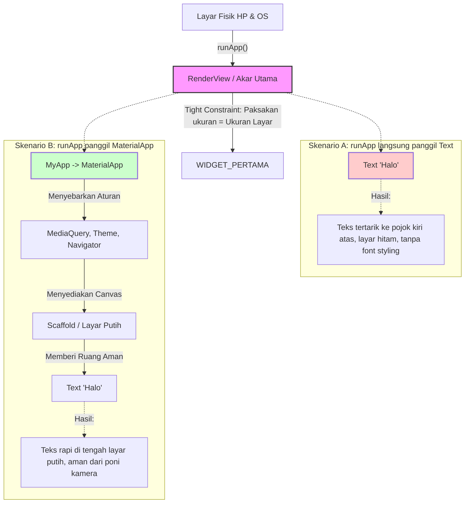

# Anatomi runApp() dan Akar Layar (Root Tree)

Dokumen ini memetakan bagaimana fungsi `runApp()` bekerja di belakang layar untuk menyambungkan kodingan Dart kita ke ukuran fisik layar HP.

---

## 1. Konsep "Tight Constraint" (Paksaan Mutlak)

Dalam Flutter, aturan *layout* (ukuran) selalu mengalir dari atas ke bawah.
Fungsi `runApp()` adalah penghubung (jembatan) antara **Layar Fisik OS** dengan **Kodingan Dart**.

Saat `runApp()` dieksekusi, *Engine* Flutter menciptakan sebuah entitas tak terlihat bernama **`RenderView`** (Ini adalah akar/pucuk dari RenderObject Tree).
`RenderView` ini mengukur besaran kaca HP (misal: 1080 x 2400 pixel). Lalu, `RenderView` memberikan perintah mutlak (*Tight Constraint*) kepada *Widget* apapun yang dimasukkan ke dalam `runApp()`:

> *"Gue nggak peduli ukuran asli lu berapa. Lu HARUS melar selebar 1080px dan setinggi 2400px!"*

---

## 2. Pemetaan Visual (Mental Model)

Berikut adalah diagram perbandingan jika kita menggunakan batu bata bodoh (`Text`) versus menggunakan Kementerian Infrastruktur (`MaterialApp`).

---

## 3. Kesimpulan Hirarki
1. **Layar OS (Kaca):** Menentukan ukuran resolusi.
2. **`runApp()` / `RenderView`:** Menempel pada OS dan memaksa ukuran tersebut ke anak pertamanya.
3. **`MaterialApp`:** Anak pertama yang rela ditarik melar sepenuh layar, lalu menggunakan ruang raksasa itu untuk mendirikan infrastruktur aplikasi (Warna, Navigasi, Ukuran Font).
4. **`Scaffold`:** Canvas putih yang disediakan `MaterialApp` agar kita bisa mulai menempel *Widget* (AppBar, Body, FloatingButton).
5. **`Text` dll:** Batu bata kecil yang duduk rapi di atas *Scaffold*.
