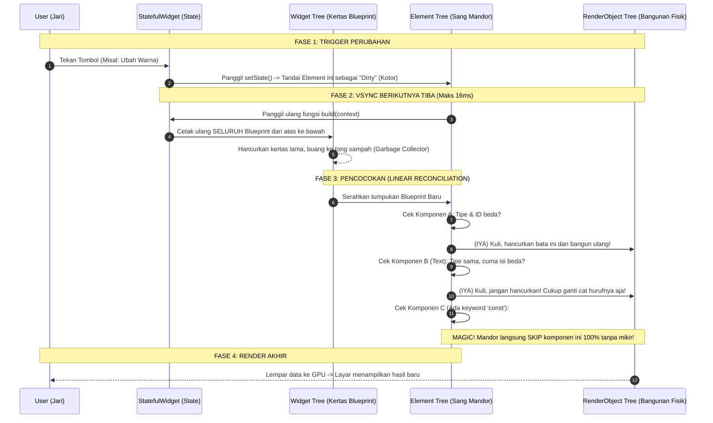

# Bedah Jeroan: setState & Rahasia The Three Trees

Dokumen ini membedah apa yang sebenarnya terjadi di bawah kap mesin Flutter saat kita memanggil fungsi `setState()`. Di sinilah rahasia performa 120FPS Flutter bersembunyi.

---

## 1. Mitos vs Fakta `setState`

*   **Mitos:** Saat `setState` dipanggil, seluruh layar dihancurkan dan digambar ulang dari nol oleh GPU.
*   **Fakta:** `setState` **HANYA** menghancurkan *Widget Tree* (Kertas Konfigurasi/Blueprint). Bangunan fisik di layarnya (*RenderObject*) **TIDAK DIHANCURKAN**, melainkan diselamatkan oleh algoritma cerdas yang membandingkan perbedaan (*Diffing*).

---

## 2. Mengenal Tiga Pohon Nyawa (The Three Trees)

Flutter memisahkan tugas UI menjadi tiga bagian peran yang sangat jelas:

1.  **Widget Tree (Kertas Blueprint):**
    *   Wujudnya cuma tulisan konfigurasi statis (*Immutable*).
    *   Sangat murah untuk dibuat dan dibuang. Membuat jutaan *Widget* hanya butuh waktu kurang dari 1 milidetik.
2.  **Element Tree (Sang Mandor):**
    *   Penengah antara kertas *Blueprint* dan kuli bangunan.
    *   Tugas utamanya adalah memegang **State** (Objek `BuildContext` sebenarnya adalah *Element*).
    *   Tugas paling mahalnya: **Reconciliation (Mencocokkan Blueprint Lama vs Baru)** menggunakan algoritma Linear O(N).
3.  **RenderObject Tree (Kuli & Bangunan Fisik):**
    *   Ini adalah objek matematika raksasa yang nyata (Punya kordinat X, Y, Width, Height, Paint).
    *   Sangat mahal untuk dibuat atau dihancurkan.
    *   *RenderObject* yang memberikan instruksi murni kepada mesin *Impeller/Skia* untuk diteruskan ke GPU.

---

## 3. Sequence Diagram Eksekusi `setState`

Berikut adalah diagram kronologis saat *user* menekan tombol yang memicu `setState()`. Diagram ini memperlihatkan bagaimana "Kertas Blueprint" dikorbankan, sementara "Bangunan Fisik" diselamatkan.

---

## 4. Pelajaran Emas: Cheat Code `const`

Dari diagram di atas (Langkah 9), kita bisa melihat kekuatan gaib dari *keyword* `const`. 

Jika kita menambahkan `const` pada sebuah Widget (misal `const Text('Judul')`), saat `setState` dipanggil, CPU tidak akan repot-repot mencetak Kertas Blueprint baru untuk *Text* tersebut. CPU akan mendaur ulang kertas memori yang persis sama. 

Karena kertas yang disetorkan ke Mandor adalah kertas lama yang sama persis wujud fisiknya di RAM, **Mandor (Element Tree) otomatis tutup mata dan melewatinya tanpa melakukan pengecekan sama sekali.** Efisiensi komputasi untuk Widget `const` otomatis menjadi **0 milidetik**.
