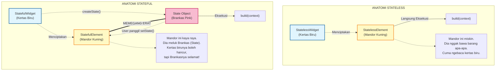
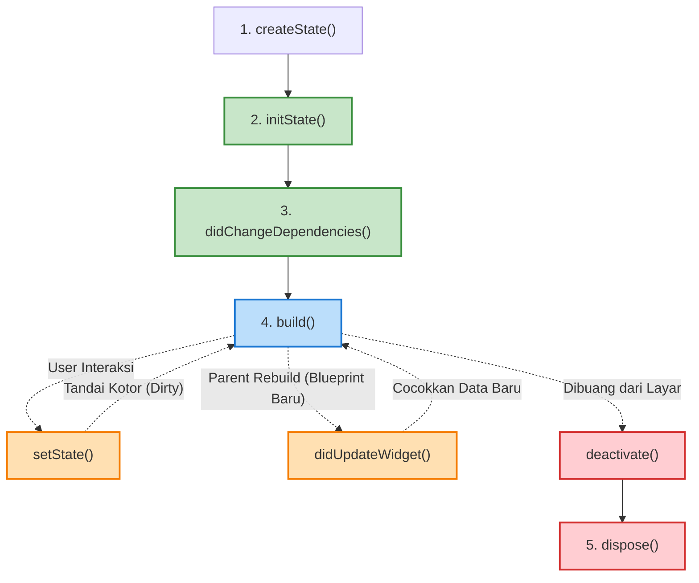

# Anatomi: StatelessWidget vs StatefulWidget

Dokumen ini membedah perbedaan anatomis di level memori (Element Tree) antara `StatelessWidget` dan `StatefulWidget`.

---

## 1. Mitos Terbesar: "StatefulWidget bisa berubah wujud"
Banyak orang mengira `StatefulWidget` itu sakti karena dia bisa berubah-ubah (Mutable).
**Faktanya: SALAH BESAR!**

Di dunia Flutter, **SEMUA WIDGET (baik Stateless maupun Stateful) ADALAH IMMUTABLE (Abadi/Tidak bisa diubah).** 
Kertas *Blueprint* biru selalu dibuang dan dicetak ulang, tidak peduli apa tipe *Widget*-nya.

Lalu di mana letak rahasia perubahannya? Rahasianya ada di tangan **Si Mandor (Element Tree)** yang memegang sebuah "Brankas Memori" bernama `State`.

---

## 2. Pemetaan Arsitektur (Mental Model)

Perhatikan diagram di bawah ini. Perbedaan utamanya ada pada apa yang **dipegang oleh Element (Si Mandor Kuning)**.

---

## 3. Penjelasan Alur Kerjanya

### A. Alur Kerja `StatelessWidget`
1. Kodingan Bos membuat `StatelessWidget` (Misal: Ikon Logo).
2. `StatelessWidget` menunjuk Mandor yang bernama **`StatelessElement`**.
3. Mandor ini **Sangat Sederhana**. Dia cuma membaca fungsi `build()` dari *Widget*, lalu meneruskannya ke bawah. Dia tidak punya kotak memori (*State*).

### B. Alur Kerja `StatefulWidget` (The Magic)
1. Kodingan Bos membuat `StatefulWidget`.
2. Pada detik pertama layar dirender, *Widget* ini langsung menetaskan sebuah objek baru bernama **`State`** (lewat fungsi `createState()`).
3. Secara paralel, *Widget* ini juga menunjuk Mandor jenis khusus bernama **`StatefulElement`**.
4. **INI KUNCI RAHASIANYA:** Mandor `StatefulElement` langsung menangkap objek `State` tadi, memeluknya dengan erat, dan menyimpannya di dalam memori RAM yang aman (Brankas).
5. Fungsi `build()` tidak dijalankan oleh *Widget*, melainkan dijalankan oleh si `State` (Brankas) tadi.

### C. Apa yang Terjadi Saat `setState()` Dipanggil?
1. Saat *User* menekan tombol, logika memanggil `setState()` di dalam Brankas.
2. Brankas langsung menendang kaki si Mandor Kuning (`StatefulElement`) dan berteriak: *"Woy Mandor, data gue berubah! Tandai area lu kotor (Dirty) sekarang!"*
3. Saat *VSync* berikutnya lewat (16ms kemudian), CPU melihat ada tanda *Dirty*. 
4. CPU **MENGHANCURKAN** kertas biru `StatefulWidget` yang lama dan **MENCETAK KERTAS BIRU BARU**.
5. Kertas biru baru diserahkan ke Mandor Kuning.
6. Apakah Brankasnya ikut hancur? **TIDAK!** Mandor Kuning tetap memeluk Brankas (`State`) yang sama sejak detik pertama tadi. Brankas itu cuma membaca kertas biru baru untuk mencocokkan strukturnya, lalu meng-*update* isi variabel di dalamnya.

---

**Kesimpulan:**
`StatefulWidget` itu sendiri sebenernya bodoh dan abadi (Immutable) persis kayak `Stateless`. Yang bikin dia kelihatan pintar dan bisa berubah wujud adalah karena dia punya **Mandor Kuning (StatefulElement) yang menjaga gawang memori bernama State**.

---

## 4. Perbandingan Siklus Hidup (Lifecycle)

Karena `StatelessWidget` itu "miskin" (tidak punya Brankas Memori), siklus hidupnya sangat pendek dan membosankan. Sebaliknya, `StatefulWidget` punya siklus hidup yang sangat panjang dan dramatis karena dia harus mengurus Brankas-nya.

### A. Lifecycle `StatelessWidget` (Pendek & Basi)
Hanya ada 1 tahap penting: Lahir -> Gambar -> Hancur.
1. `build(context)`: Menyatukan Blueprint untuk dilempar ke Mandor. (Selesai).
*Catatan: Tidak ada memori yang dipertahankan. Tiap ada perubahan di atasnya, dia murni hancur dan lahir kembali dari nol.*

### B. Lifecycle `StatefulWidget` (Panjang & Kompleks)
Karena melibatkan Brankas (`State`), ada banyak titik intervensi (seperti operasi jantung) yang bisa Bos manfaatkan.

**Penjelasan Tahapan Kritis di `StatefulWidget`:**
1. **`initState()`**: Dijalankan **HANYA 1 KALI** seumur hidup Brankas. Tempat paling wajib untuk pesen *Controller* (Animasi/Scroll), *fetch API* pertama kali, atau *subscribe WebSocket*.
2. **`didChangeDependencies()`**: Dijalankan setelah `initState`, dan bakal kepanggil lagi kalau Bos bergantung pada `InheritedWidget` (contoh: `Provider`, `Theme`, `MediaQuery`) lalu data global itu berubah.
3. **`build()`**: Jantung utama. Dijalankan **berkali-kali**. **HARAM HUKUMNYA** menaruh logika berat seperti *fetching API* atau hitungan *Looping* raksasa di sini, karena bakal menahan laju VSync dan bikin HP nge-*lag* (Jank).
4. **`didUpdateWidget(oldWidget)`**: Dipanggil otomatis kalau Kertas Biru (*Widget*) dicetak ulang oleh *Parent* di atasnya (Skenario `canUpdate == TRUE`). Brankas bisa ngelihat perbedaan antara `oldWidget` dan `widget` baru di sini, buat nentuin *"Oh, ID barangnya ganti, gue harus reset animasi nih"*.
5. **`setState()`**: Tombol panik untuk menyuruh mesin manggil `build()` ulang. **HANYA ADA DI DALAM BRANKAS (`State`)**. Kertas Biru (`StatefulWidget`) nggak punya fitur ini!
6. **`dispose()`**: Pesan wasiat terakhir sebelum Brankas dihancurkan permanen dari RAM. Sangat krusial buat menutup *Stream*, *ScrollController*, *TextEditingController* atau *Timer*. Kalau lupa ditaruh di sini = **MEMORY LEAK!** (HP makin lama makin panas karena RAM penuh sampah).
