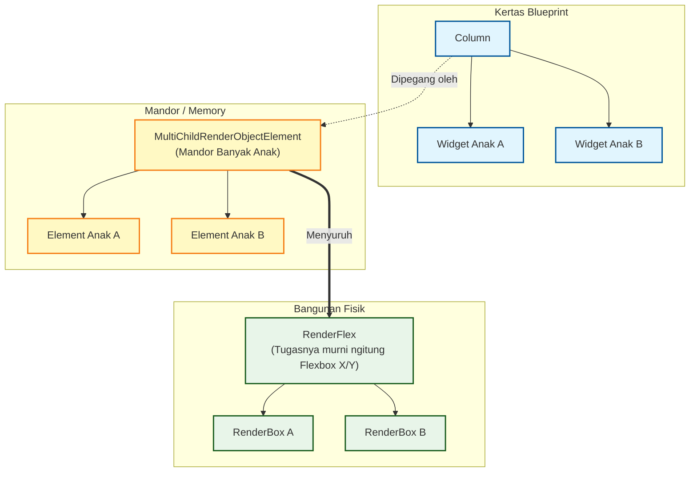
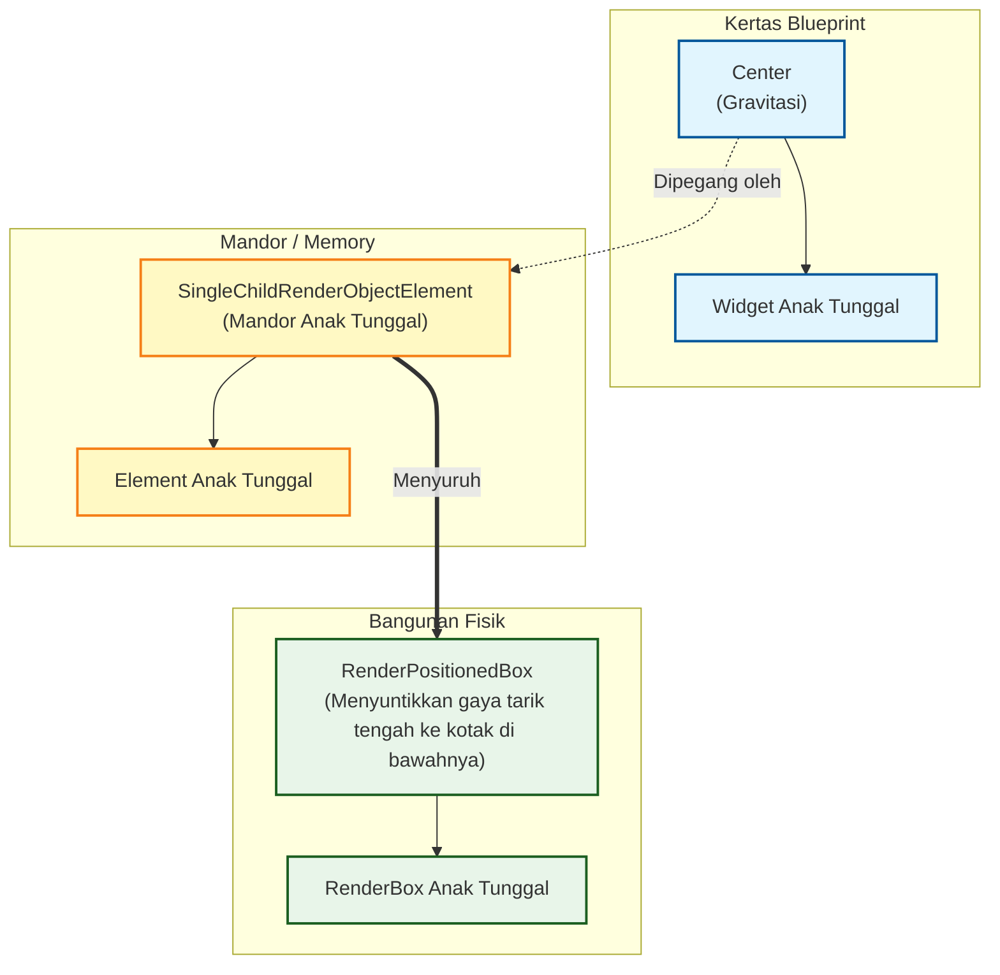
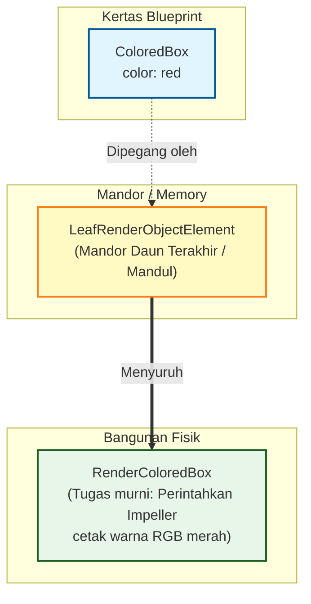

# Anatomi Mutlak 3 Kasta UI di Dalam "The Three Trees"

Sesuai permintaan, ini adalah rontgen arsitektur level *Hardcore*. Kita membedah bagaimana 3 Kasta UI (Layout, Gravitasi, Atom) memiliki bentuk tulang punggung yang **berbeda total** saat mereka turun ke level `Element` dan `RenderObject`.

---

## 1. Anatomi Kasta Pengatur Ruang (Layout)
**Sifat Asli:** Mereka punya BANYAK anak (`children: []`).
**Rahasia Mesin:** Di level mesin, mereka berubah wujud menjadi `MultiChildRenderObjectElement` dan menggunakan logika *Flexbox* atau *Stacking* untuk membagi sisa ruang.
*Contoh Kasus: `Column` yang memegang 2 anak.*

---

## 2. Anatomi Kasta Gravitasi & Constraint
**Sifat Asli:** Mereka CUMA punya SATU anak (`child:`). Tugas mereka hanya mencekik leher anaknya (mengurangi ukuran) atau menarik anaknya ke sudut tertentu.
**Rahasia Mesin:** Di level mesin, mereka adalah `SingleChildRenderObjectElement`. Fisiknya menggunakan kotak pelapis (*ProxyBox* / *ShiftedBox*).
*Contoh Kasus: `Center` yang memegang 1 anak.*

---

## 3. Anatomi Kasta Atom & Molekul (Batu Bata Fisik)
**Sifat Asli:** Mereka MANDUL (TIDAK punya anak). Merekalah ujung tombak yang benar-benar memegang kuas cat untuk melukis ke layar.
**Rahasia Mesin:** Di level mesin, mereka adalah **Daun Terakhir** (`LeafRenderObjectElement`). RenderObject mereka langsung ngobrol ke mesin C++ Impeller untuk menyalakan lampu *pixel*.
*Contoh Kasus: `ColoredBox` (Warna Merah).*

---

## Rangkuman Otak Cerdas (Cheat Sheet)

Kalau Bos lagi ngebedah kodingan orang atau bikin arsitektur, ingat selalu bentuk anatomi di atas:

1.  **Pengatur Ruang (`MultiChild...`)**: Tugas *RenderObject*-nya berat di **Matematika Koordinat** (ngitung *Flex*, pembagian rasio layar), tapi dia nggak ngecat apa-apa.
2.  **Gravitasi (`SingleChild...`)**: Tugas *RenderObject*-nya murni ngakalin **BoxConstraints** (Batas Min/Max Width/Height) sebelum diteruskan ke anak semata wayangnya.
3.  **Atom (`Leaf...`)**: Tugas *RenderObject*-nya murni **Fisika Cahaya/Warna** (Panggil `canvas.drawRect` atau `canvas.drawText`). Nggak ada lagi hitung-hitungan anak.
