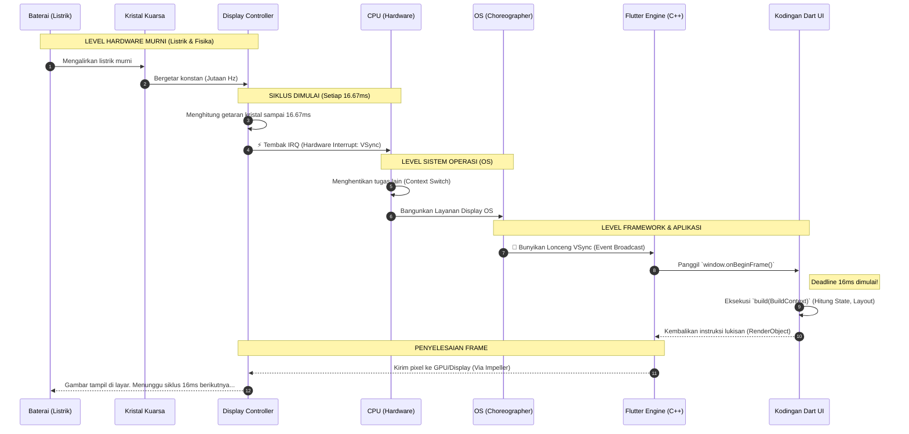

# Deep Dive: VSync & Teknologi Display Hardware

Dokumen ini membedah lebih dalam bagaimana layar sebuah HP bisa berkedip tepat waktu (60/120 kali per detik) dan teknologi fisik apa yang menciptakan sinyal 16 milidetik tersebut.

---

## 1. Ilusi Visual (Persistence of Vision)

Sebelum masuk ke *hardware*, kita harus paham kenapa layar HP harus diperbarui 60 kali per detik (60 FPS / 16ms). Layar perangkat elektronik sebenarnya buta dan tidak bisa menyimpan memori "Pergerakan UI". Layar murni hanya menampilkan "Kumpulan Foto Mati" (*Still Image*).

Otak manusia memiliki *bug* biologis bernama **Persistence of Vision**. Jika mata manusia disajikan lebih dari 24 gambar mati yang berbeda posisinya secara berturut-turut dalam 1 detik, otak kita akan tertipu dan menjahitnya menjadi ilusi pergerakan yang mulus (Animasi). Semakin tinggi jumlah gambar per detiknya (60 fps atau 120 fps), semakin mulus ilusinya.

---

## 2. Kristal Osilator (Jantung Utama Hardware)

Dari mana asal mula waktu "16 milidetik" itu dihitung? Jawabannya ada pada sebuah komponen fisik di *Motherboard* HP bernama **Oscillator Crystal (Kristal Kuarsa)**.

*   Ini adalah batu kristal nyata berukuran mikroskopis.
*   Ketika dialiri listrik, kristal ini akan **bergetar (beresonansi)** pada frekuensi yang sangat presisi dan stabil (misal: jutaan kali per detik).
*   Getaran ini adalah fondasi dari semua perhitungan waktu di komputer. Tanpa kristal ini, HP tidak akan tahu seberapa cepat 1 detik itu berlalu.

---

## 3. Display Controller (Sang Penghitung Waktu)

Getaran dari Kristal Osilator ditangkap oleh *chip* perangkat keras bernama **Display Controller**. 

*   *Display Controller* menggunakan getaran kristal tersebut sebagai penggaris waktu. Dia menghitung getaran tersebut sampai tepat mencapai **16.67 milidetik** (untuk layar 60Hz).
*   Tepat di angka 16.67ms, *Display Controller* akan menembakkan sinyal listrik darurat yang disebut **Hardware Interrupt (IRQ)**.

---

## 4. Hardware Interrupt & VSync (Listrik Penagih Hutang)

Sinyal IRQ dari *Display Controller* ini bekerja seperti Setruman Listrik yang memaksa CPU untuk berhenti melakukan pekerjaannya sejenak.

*   Sinyal setruman inilah yang kita kenal dengan nama **VSync (Vertical Synchronization)**.
*   Pesan listrik ini pada dasarnya berteriak ke CPU: *"Woy! Layar baru aja selesai nyapuin warna ke semua pixel dari ujung kiri atas ke kanan bawah! Layar sekarang kosong! Mana gambar selanjutnya?! Gue butuh SEKARANG!"*

---

## 5. Choreographer (Android) & CADisplayLink (iOS)

CPU (yang di dalamnya ada Sistem Operasi Android/iOS) terbangun karena kaget tersengat sinyal VSync tersebut. Sistem Operasi tidak langsung memberikannya ke Flutter, melainkan mengelolanya lewat mandor OS:

*   **Android (Choreographer):** Sebuah layanan di dalam Android yang khusus menangkap sinyal VSync dari Hardware. Setelah ditangkap, *Choreographer* akan memukul lonceng dan meneriaki semua aplikasi yang sedang terbuka: *"Woy aplikasi! VSync udah bunyi nih, ayo kirim gambar kalian!"*
*   **iOS (CADisplayLink):** Versi Apple dari *Choreographer*. Fungsinya sama persis, membangunkan aplikasi yang sedang aktif untuk segera merender frame baru.

---

## 6. Flutter Engine Mengeksekusi Kode (Deadline 16ms)

Di sinilah kodingan Dart kita bekerja. Flutter Engine (C++) selalu "berlangganan" (*subscribe*) ke lonceng *Choreographer* (Android) atau *CADisplayLink* (iOS).

Begitu lonceng berbunyi:
1. Flutter Engine meneruskannya ke Dart dengan memanggil fungsi rahasia `window.onBeginFrame`.
2. Kodingan `build(BuildContext context)` milik kita langsung dieksekusi oleh Dart VM.
3. Kodingan kita harus selesai menghitung posisi UI, merakit pohon *Widget*, menyerahkannya ke mesin *Skia/Impeller*, dan mengirim kembali gambar matinya ke GPU **SEBELUM 16 MILIDETIK BERAKHIR**.

### Bencana Jank (Lag)
Jika kodingan Dart kita terlalu rumit (misal melakukan *parsing JSON* raksasa di dalam fungsi `build`), komputasinya memakan waktu 30 milidetik. Akibatnya, saat layar teriak meminta gambar baru di milidetik ke-16, gambar dari Flutter belum siap! 
Layar tidak mau menunggu. Ia akan terpaksa **menampilkan gambar lama yang basi** sekali lagi. Lompatan inilah yang dilihat mata pengguna sebagai *Lag/Jank/Patah-patah*.

> **Kesimpulan:** Arsitektur UI tidak lebih dari sebuah pabrik pembuat *Flipbook* (buku gambar animasi) yang dipaksa bekerja di bawah ancaman cambukan VSync setiap 16 milidetik.

---

## 7. Sequence Diagram VSync (Listrik ke UI)

Berikut adalah diagram sekuensial yang merangkum seluruh perjalanan sinyal dari level elektron (listrik murni) hingga dieksekusi oleh kodingan Dart.

